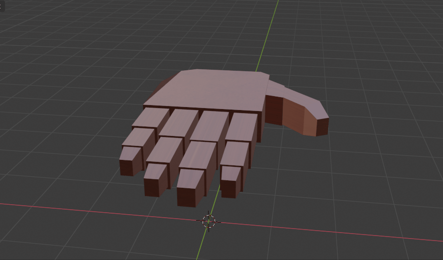
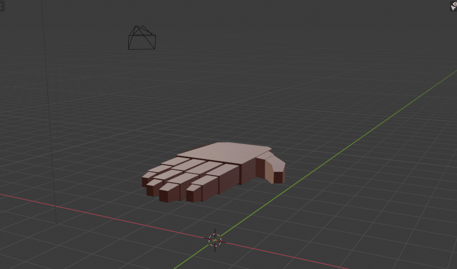

# Modeling Hello World

This project is the third assignment for the Introduction in Mixed Realities course at UAIC Faculty of Computer Science Iasi:
Create 3 animations for a hand model. You can create this model by yourself or import it from a website.

For our model we used a cube as the base and extruded sides to create the fingers.

Grab animation

Point animation

Wave animation

Team:
Petrovici Stefan
Camelia Lupancu